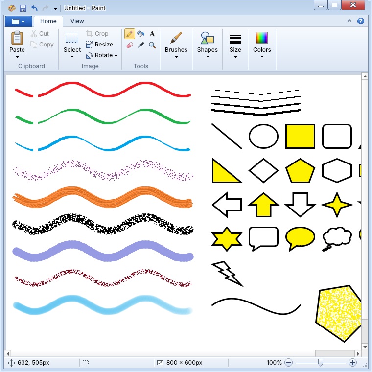

# OpenDraw7

An open-source paint program for Linux that looks and works like the Paint that shipped with
Windows 7: the same ribbon, the same tools, the same shortcuts.



All code and artwork here are original. OpenDraw7 is not affiliated with or endorsed by Microsoft.

## Get it

**Ready-made build (Linux, 64-bit Intel/AMD).** Download `OpenDraw7-<version>-linux-x86_64.tar.gz`
from the Releases page, unpack it, then either run it in place or install it for your user:

```sh
tar -xzf OpenDraw7-*-linux-x86_64.tar.gz
cd OpenDraw7
./opendraw7          # try it
./install.sh         # or add it to your applications menu (no root needed)
```

It needs glibc 2.34 or newer (Ubuntu 22.04, Mint 21, Debian 12, Fedora 35 and later).

**From source (Linux, macOS, Windows).** Needs Python 3.9+.

```sh
pip install PySide6-Essentials numpy
python run.py        # or: pip install . && opendraw7
```

## What is in it

- **Ribbon interface**: title bar with quick access toolbar, the blue application menu, Home and
  View tabs, the Text tab that appears while typing, status bar with zoom slider. Groups collapse
  into drop-downs when the window gets narrow, and the ribbon can be minimized.
- **Tools**: pencil, fill, text, eraser (right-drag replaces color 1 with color 2), color picker,
  magnifier.
- **Brushes**: brush, two calligraphy brushes, airbrush, oil brush, crayon, marker, natural pencil,
  watercolor.
- **Shapes**: all 23 (line, curve, oval, rectangle, rounded rectangle, polygon, triangles, diamond,
  pentagon, hexagon, arrows, stars, callouts, heart, lightning) with the seven outline and fill
  styles. A shape stays adjustable (move, resize, recolor) until you click away.
- **Selections**: rectangular and free-form, move, Ctrl-drag to copy, resize by the handles,
  transparent selection, select all, invert selection, crop, delete.
- **Image**: resize and skew, rotate and flip, invert color, canvas resize by its handles,
  image properties.
- **View**: zoom from 12.5% to 800%, rulers, gridlines, thumbnail, full screen.
- **Files**: PNG, JPEG, BMP (monochrome, 16-color, 256-color, 24-bit), GIF, TIFF; ICO and WebP can
  be opened. Recent pictures, drag a file onto the window to open it, print, page setup and print
  preview, send in e-mail, set as desktop background.
- **Undo**: up to 50 steps.

### Shortcuts

| | |
|---|---|
| Ctrl+N / O / S, F12 | New, open, save, save as |
| Ctrl+Z / Y | Undo, redo |
| Ctrl+A / X / C / V, Del | Select all, cut, copy, paste, delete selection |
| Ctrl+Shift+X | Crop |
| Ctrl+W, Ctrl+E | Resize and skew, properties |
| Ctrl+R, Ctrl+G | Rulers, gridlines |
| Ctrl+PgUp / PgDn | Zoom in, out |
| Ctrl++ / Ctrl+- | Thicker, thinner line |
| F11 | Full screen |
| Ctrl+F1 | Minimize the ribbon |
| Shift while drawing | Squares, circles, 45° lines |
| Esc | Cancel the shape, text box or selection in progress |

## Where it differs from the original

The layout, tool behaviour and colours were rebuilt from how the original works, not measured
against a running copy, so do not expect a pixel-for-pixel match.

- **Icons and cursors** are redrawn; the originals are copyrighted.
- **Fonts**: the interface uses Segoe UI if it is installed, otherwise the closest font on the
  system, so text widths differ slightly.
- **Artistic brushes and shape media** (oil, crayon, marker, natural pencil, watercolor) are
  approximations of the originals' textures.
- **Window frame**: OpenDraw7 draws its own title bar so the quick access toolbar can sit in it.
  Start with `--native-frame` to use the desktop's title bar instead.
- **Dialogs** (open, save, print, edit colors) are the Qt or desktop ones.
- **From scanner or camera** is present but disabled.
- **Help** opens the About box.
- **Keyboard key tips** (pressing Alt to show letters on the ribbon) are not implemented.

On Wayland desktops OpenDraw7 runs through XWayland by default, because that is where the custom
title bar has been tested. Set `QT_QPA_PLATFORM=wayland` to try native Wayland.

## Build the Linux package

```sh
pip install PySide6-Essentials numpy pyinstaller
packaging/build.sh           # writes dist/OpenDraw7-<version>-linux-x86_64.tar.gz
```

`packaging/fetch_vendor.sh` downloads a few small X11 helper libraries (notably `libxcb-cursor0`,
which Qt needs and many desktops lack). Other system libraries are deliberately left out of the
package so that it does not depend on the build machine's C library. For the widest compatibility,
build with a Python that itself targets an old glibc, such as the standalone builds that `uv`
installs.

## Tests

```sh
QT_QPA_PLATFORM=offscreen python tests/smoke_test.py
```

## Layout

| File | What it holds |
|---|---|
| `opendraw7/mainwindow.py` | Builds the tabs and wires every command |
| `opendraw7/ribbon.py` | Ribbon buttons, groups, tab strip, galleries, popups |
| `opendraw7/chrome.py` | Title bar, status bar, zoom slider, rulers |
| `opendraw7/appmenu.py` | The application menu |
| `opendraw7/canvas.py` | Scrolling work area, zoom, edit commands |
| `opendraw7/tools.py` | Every canvas tool |
| `opendraw7/brushes.py` | Stroke engines, textures, shape styling |
| `opendraw7/shapes.py` | Geometry of the 23 shapes |
| `opendraw7/document.py` | Pixels, undo, flood fill, file formats |
| `opendraw7/icons.py` | All icons and cursors, drawn in code |
| `opendraw7/theme.py` | Colours, fonts, metrics |

## Licence

MIT, see [LICENSE](LICENSE). The packaged build includes Qt and PySide6 (LGPL v3), Python,
NumPy and a few X11 helper libraries under their own licences.
